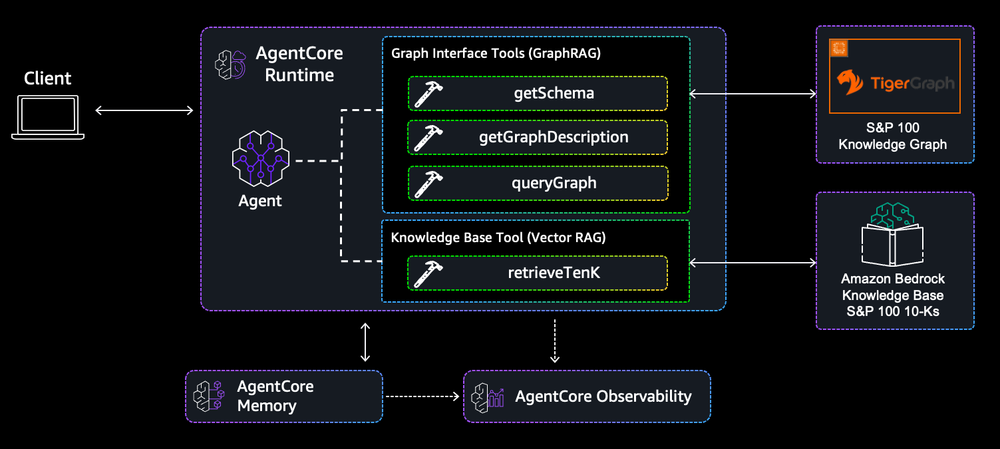

# Agentic GraphRAG for Capital Markets

AI agent combining Knowledge Graph (TigerGraph) and Vector RAG (Amazon Bedrock Knowledge Base) to analyze SEC 10-K filings for S&P 100 companies.

## Overview

This demo showcases a financial analysis agent that queries both:
- **TigerGraph** - Structured knowledge graph with entities, events, and relationships
- **Amazon Bedrock Knowledge Base** - Vector embeddings of unstructured 10-K document text

The agent can answer complex questions like:
- "What are Apple's main risk factors?"
- "Which companies operate in China?"
- "Compare supply chain risks across tech companies"

## Disclaimer

**This is a demonstration sample, not production-ready code.** AI-generated financial analysis may contain errors or hallucinations. Do not use for actual investment decisions without proper verification.

## Architecture



*Financial analysis agent combining GraphRAG and VectorRAG*

## Security Notes

**Demo-grade deployment characteristics:**
- TigerGraph uses default credentials ("tigergraph"/"tigergraph") - change for production
- OpenSearch Serverless configured for Bedrock Knowledge Base integration
- Bedrock Guardrails enabled for content filtering and PII protection
- NAT Gateway costs ~$30-45/month for private networking

For production deployments:
- Change TigerGraph password ([documentation](https://docs.tigergraph.com/tigergraph-server/current/user-access/user-management#_change_a_users_password))
- Use AWS Secrets Manager for credentials
- Enable CloudTrail logging
- Implement least privilege IAM policies

## Prerequisites

- **AWS Account** with Bedrock access in us-east-1
- **Node.js** >= 18
- **Python** >= 3.10
- **AWS CLI** configured with appropriate credentials
- **TigerGraph Community Edition** docker image (downloaded manually)

## Quick Start

### Part 1: Prepare Data & Docker Image (10 minutes)

#### 1.1 Download TigerGraph Docker Image

Download TigerGraph Community Edition Docker Image from [TigerGraph Downloads](https://dl.tigergraph.com/)

#### 1.2 Prepare Graph Data

Download the triplet dataset from [KG-Financial-Datasets-SP-100](https://anonymous.4open.science/r/KG-Financial-Datasets-SP-100-529B/README.md)

Then run:

```bash
# Update base_path in the script to point to your downloaded data
cd data-prep
python flatten_triplets_to_csv.py
```

This creates CSV files in `data-prep/output/` for loading into TigerGraph.

### Part 2: Deploy AWS Infrastructure (10 minutes)

#### 2.1 Install CDK Dependencies

```bash
cd tenkAnalyzerAgent/cdk
npm install
```

#### 2.2 Deploy CDK Stacks

```bash
# Synthesize to verify no errors
npm run cdk synth

# Deploy Docker image first
npm run cdk deploy tenkAnalyzerAgent-DockerImageStack

# Deploy main stack (no context variables needed!)
npm run cdk deploy tenkAnalyzerAgent-AgentCoreStack
```

> **Important:** This sample deploys to your AWS CLI's default region. Ensure your `~/.aws/config` default region is set to `us-east-1` to match the `--region` flags used throughout this guide. You can check your default region with `aws configure get region`.

**CDK creates:**
- VPC with public/private subnets + NAT Gateway
- TigerGraph EC2 instance (private subnet, no public IP)
- AgentCore runtime (VPC mode)
- S3 staging bucket (for TigerGraph data)
- S3 bucket for 10-K documents
- Bedrock Knowledge Base

**Save the outputs:**
- `StagingBucketName` - for TigerGraph docker image and data
- `TigerGraphInstanceId` - EC2 instance ID for SSM
- `TigerGraphPrivateIp` - EC2 private IP (auto-configured in agent)
- `TenkBucketName` - for 10-K documents
- `KnowledgeBaseId` - for Bedrock KB
- `DataSourceId` - for syncing KB

### Part 3: Set Up TigerGraph on EC2 (15 minutes)

#### 3.1 Upload TigerGraph Docker Image and Data to S3

```bash
# Upload TigerGraph docker image
# Your docker image file name may differ. Modify the command to match the file you downloaded.
aws s3 cp ~/Downloads/tigergraph-4.2.2-community-docker-image.tar.gz \
  s3://<StagingBucketName>/

# Upload prepared data
aws s3 sync ./data-prep/output/ s3://<StagingBucketName>/data-prep/output/
aws s3 sync ./data-prep/tg-gsql/ s3://<StagingBucketName>/data-prep/tg-gsql/
```

#### 3.2 Connect to EC2 via SSM

```bash
aws ssm start-session --target <TigerGraphInstanceId>
```

#### 3.3 Set Up TigerGraph on EC2

```bash
# Change to home directory (SSM starts in /usr/bin)
cd ~

# Update system and install Docker
sudo yum update -y
sudo yum install docker -y
sudo service docker start

# Download files from S3
aws s3 cp s3://<StagingBucketName>/tigergraph-4.2.2-community-docker-image.tar.gz .
aws s3 sync s3://<StagingBucketName>/data-prep/ ~/data-prep/

# Load and run TigerGraph
sudo docker load -i tigergraph-4.2.2-community-docker-image.tar.gz
sudo docker images  # Note the IMAGE_ID

# Start TigerGraph container
sudo docker run -d -p 14240:14240 -p 9000:9000 \
  --name tgDemo <IMAGE_ID>

# Wait ~30 seconds for TigerGraph to initialize, then enter container
sudo docker exec -it tgDemo /bin/bash

# Inside container - start TigerGraph services
gadmin start all

# Check status (should see all services running)
gadmin status

# Exit container
exit
```

#### 3.4 Load Data into TigerGraph

```bash
# Copy data files into container
sudo docker cp ~/data-prep tgDemo:/home/tigergraph/

# Enter container
sudo docker exec -it tgDemo /bin/bash

# Inside container:
cd /home/tigergraph/data-prep/tg-gsql

# Load schema and data
gsql schema.gsql
gsql load_chunks.gsql
gsql load_triplets.gsql

# Exit container
exit
```

**Note:** TigerGraph is now running and accessible to AgentCore at the private IP address.

Exit the SSM session before continuing:
```bash
exit  # Exit SSM session back to your local machine
```

### Part 4: Populate Knowledge Base (20 minutes)

#### 4.1 Download 10-K Documents to S3

```bash
cd data-prep

# Install required dependencies
pip install pandas boto3 requests beautifulsoup4

# Use bucket name from CDK output
python get-tenks.py \
  --bucket <TenkBucketName> \
  --email your-email@example.com
```

This downloads 101 10-K filings (~5 minutes).

#### 4.2 Sync Knowledge Base

Trigger a sync to index the documents:

```bash
# Use IDs from CDK outputs
aws bedrock-agent start-ingestion-job \
  --knowledge-base-id <KnowledgeBaseId> \
  --data-source-id <DataSourceId> \
  --region us-east-1
```

**Check sync progress:**

```bash
# Replace with your ingestion job ID from the start command output
aws bedrock-agent get-ingestion-job \
  --knowledge-base-id <KnowledgeBaseId> \
  --data-source-id <DataSourceId> \
  --ingestion-job-id <IngestionJobId> \
  --region us-east-1
```

Status progression: `STARTING` → `IN_PROGRESS` → `COMPLETE`

**Or** use the AWS Console:
1. Navigate to Amazon Bedrock → Knowledge Bases
2. Select your knowledge base
3. Click "Sync" on the data source

Wait for sync to complete (~10-15 minutes for ~100 documents).

### Part 5: Test the Agent (5 minutes)

#### Option 1: Interactive Notebook (Recommended)

Open `test_agent.ipynb` in Jupyter:

```bash
# Install Jupyter if needed
pip install jupyter

# Launch notebook
jupyter notebook test_agent.ipynb
```

The notebook provides:
- Pre-configured example queries
- Multi-turn conversation testing
- Batch query capabilities
- Session management
- Troubleshooting guidance

#### Option 2: CLI

```bash
# Using agentcore CLI
agentcore invoke '{"prompt": "What are Apple'\''s main risk factors?"}'
```

#### Option 3: AWS Console

Navigate to Bedrock AgentCore → Runtimes → Test Console

#### Option 4: Python Script

```python
import boto3
import json

client = boto3.client('bedrock-agentcore', region_name='us-east-1')
payload = json.dumps({"prompt": "What are Apple's main risk factors?"})

response = client.invoke_agent_runtime(
    agentRuntimeArn='arn:aws:bedrock-agentcore:us-east-1:ACCOUNT:runtime/tenkAnalyzerAgent_Agent-XXX',
    runtimeSessionId='test-session-12345678901234567890123456789012',
    payload=payload,
    qualifier="DEFAULT"
)
response_body = response['response'].read()
response_data = json.loads(response_body)
print(response_data.get('output', response_data))
```

## Project Structure

```
├── README.md                          # This file
├── data-prep/                         # TigerGraph data preparation
│   ├── flatten_triplets_to_csv.py     # Convert triplets to CSV
│   ├── get-tenks.py                   # Download 10-Ks to S3
│   └── tg-gsql/                       # TigerGraph schema and load scripts
│       ├── schema.gsql
│       ├── load_chunks.gsql
│       └── load_triplets.gsql
└── tenkAnalyzerAgent/                 # Agent application
    ├── src/
    │   └── main.py                    # Agent implementation
    └── cdk/                           # Infrastructure as Code
        ├── bin/cdk.ts                 # CDK entry point
        └── lib/stacks/
            ├── agentcore-stack.ts     # Main stack (S3, KB, Agent)
            └── docker-image-stack.ts  # Docker image for agent
```

## Configuration

### Automatic Configuration

The CDK stack automatically configures TigerGraph connection:
- **TG_HOST**: Set to EC2 private IP automatically (`http://10.0.X.X:14240`)
- **TG_USERNAME**: Hardcoded as "tigergraph" (default)
- **TG_PASSWORD**: Hardcoded as "tigergraph" (default)
- **TG_GRAPHNAME**: Hardcoded as "CapMarkets"

No CDK context variables required! The infrastructure handles everything.

### Network Architecture

```
VPC (10.0.0.0/16)
├── Public Subnets (NAT Gateway)
└── Private Subnets
    ├── TigerGraph EC2 (10.0.X.X:14240, no public IP)
    └── AgentCore Runtime (VPC mode)
        └── Connects to TG via private IP
```

**Security:**
- TigerGraph has no public IP
- Security groups allow only AgentCore → TigerGraph:14240
- SSM Session Manager for EC2 access (no SSH keys)
- S3 Gateway Endpoint for free S3 access

## Example Queries

```json
{"prompt": "What are Apple's main risk factors?"}
{"prompt": "Which S&P 100 companies operate in China?"}
{"prompt": "Compare supply chain dependencies between tech companies"}
{"prompt": "What ESG initiatives does Microsoft mention?"}
{"prompt": "Find companies exposed to semiconductor shortages"}
```

## Troubleshooting

### Agent can't connect to TigerGraph

**First invocation after deployment may fail** - this is expected! TigerGraph isn't running yet when AgentCore deploys. After you set up TigerGraph on EC2, subsequent invocations will succeed (agent uses lazy connection).

If agent still can't connect after TigerGraph setup:

1. **Verify TigerGraph is running on EC2:**
   ```bash
   aws ssm start-session --target <TigerGraphInstanceId>
   sudo docker ps  # Should show tgDemo running
   sudo docker exec tgDemo gadmin status  # All services should be UP
   ```

2. **Check EC2 private IP matches AgentCore config:**
   - Get from CloudFormation outputs: `TigerGraphPrivateIp`
   - Should match `TG_HOST` in AgentCore environment variables

3. **Verify Security Groups:**
   - AgentCore SG should allow outbound to TigerGraph SG on port 14240
   - Check in AWS Console → VPC → Security Groups

4. **Check AgentCore logs:**
   ```bash
   # CloudWatch Logs → Log Groups → /aws/bedrock-agentcore/runtimes/
   ```
   Look for "TigerGraph connection not available" warnings

### Knowledge Base returns no results
- Verify documents were uploaded to S3 in `tenks/` prefix
- Check that ingestion job completed successfully
- View CloudWatch logs for the Knowledge Base

### CDK deployment fails
- Ensure you have appropriate AWS permissions
- Check that you're in the correct AWS region
- Verify Docker is running (for image build)

### TypeScript errors in CDK
```bash
cd tenkAnalyzerAgent/cdk
rm -rf node_modules package-lock.json
npm install
```

## Data Sources

This sample uses the following external data sources:

- **Graph Data**: [KG-Financial-Datasets-SP-100](https://anonymous.4open.science/r/KG-Financial-Datasets-SP-100-529B/README.md) - Knowledge graph triplets extracted from 10-K filings. Users download this dataset directly from the source and are responsible for compliance with the dataset's terms of use.

- **10-K Documents**: Downloaded from [SEC EDGAR](https://www.sec.gov/edgar/searchedgar/companysearch) - Public SEC filings retrieved via the `get-tenks.py` script. Users are responsible for compliance with [SEC Terms of Use](https://www.sec.gov/os/webmaster-faq#code-support).

**Note**: This repository does not include or redistribute any dataset files. All data is downloaded directly from original sources by the user.

## Cleanup

To avoid AWS charges:

```bash
# Delete the CDK stacks
cd tenkAnalyzerAgent/cdk
npm run cdk destroy tenkAnalyzerAgent-AgentCoreStack
npm run cdk destroy tenkAnalyzerAgent-DockerImageStack

# Manually delete:
# - S3 bucket contents (CDK won't delete due to RETAIN policy)
# - OpenSearch Serverless collection (if created)
```

## Learn More

- [Bedrock AgentCore Documentation](https://docs.aws.amazon.com/bedrock-agentcore/)
- [TigerGraph Documentation](https://docs.tigergraph.com/)
- [AWS CDK Documentation](https://docs.aws.amazon.com/cdk/)

## Security

See [CONTRIBUTING](CONTRIBUTING.md) for more information.

## License

This library is licensed under the MIT-0 License. See the LICENSE file.
